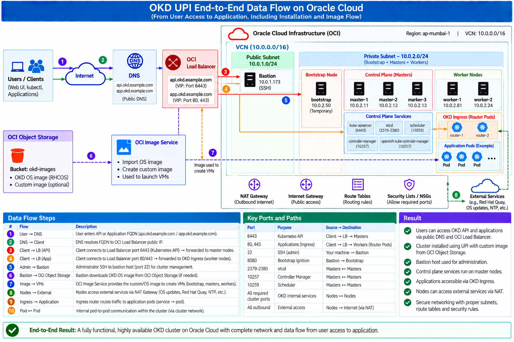

# OKD UPI Installation on Oracle Cloud Infrastructure (OCI)

## Project Overview

This project demonstrates the deployment of an OKD cluster on Oracle Cloud Infrastructure (OCI) using the **User-Provisioned Infrastructure (UPI)** installation approach.

The OCI infrastructure is provisioned using **Terraform**, including the VCN, subnets, routing, security rules, compute instances, DNS, and Load Balancer components required for the OKD cluster.

The OKD cluster consists of:

- 3 Control Plane (Master) nodes
- 2 Worker nodes
- 1 temporary Bootstrap node
- 1 Bastion host

The project also uses an OCI-based custom OS image workflow to provision the cluster nodes and configures DNS and OCI Load Balancing for API and application access.

### Key Technologies

- **OKD 4.22**
- **Kubernetes**
- **Oracle Cloud Infrastructure (OCI)**
- **Terraform**
- **OCI Load Balancer**
- **OCI DNS**
- **OCI Object Storage**
- **OCI Custom Images**
- **Linux / RHCOS-compatible OS**
- **UPI installation methodology**

### High-Level Architecture

The deployment follows this general flow:
```text
                    Internet / Users
                           |
                           v
                         DNS
                           |
                           v
                  OCI Load Balancer
                    /             \
                 :6443           :80/:443
                   |                 |
                   v                 v
             Master Nodes       Worker Nodes
                (3)                 (2)
                                   |
                                   v
                           OKD Ingress Router
                                   |
                                   v
                            Application Pods
```

Infrastructure provisioning is handled separately from the OKD installation:
```text
                    Terraform
                        |
                        v
              OCI Infrastructure
                        |
        +---------------+---------------+
        |               |               |
       VCN          Load Balancer      DNS
        |
   +----+-------------------------------+
   |                                    |
Public Subnet                    Private Subnet
10.0.1.0/24                     10.0.2.0/24
   |                                    |
Bastion                         +--------+--------+
                                |        |        |
                             Bootstrap Masters Workers
                                (1)      (3)    (2)
```


## Architecture

The following diagram shows the complete OKD UPI architecture deployed on Oracle Cloud Infrastructure (OCI).



### Architecture Components

| Component | Purpose |
|---|---|
| **OCI VCN** | Provides the network boundary for the OKD environment |
| **Public Subnet** | Hosts the Bastion and public-facing OCI Load Balancer |
| **Private Subnet** | Hosts the Bootstrap, Control Plane, and Worker nodes |
| **Bastion Host** | Provides administrative access and temporarily serves `bootstrap.ign` |
| **Bootstrap Node** | Temporarily initializes the OKD control plane during UPI installation |
| **Control Plane Nodes** | 3-node highly available OKD control plane |
| **Worker Nodes** | Run application workloads and OKD Ingress Router pods |
| **OCI Load Balancer** | Provides API and application traffic distribution |
| **OCI DNS** | Resolves API and application endpoints |
| **OCI Object Storage** | Stores the OKD OS image used during the custom image workflow |
| **OCI Custom Image** | Provides the base image used to create OKD infrastructure nodes |

### Network Layout

The deployment uses two subnets:

```text
Public Subnet
10.0.1.0/24
│
└── Bastion
    │
    └── Temporary bootstrap.ign HTTP server
```
```text
Private Subnet
10.0.2.0/24
│
├── Bootstrap
├── Master-1
├── Master-2
├── Master-3
├── Worker-1
└── Worker-2
```