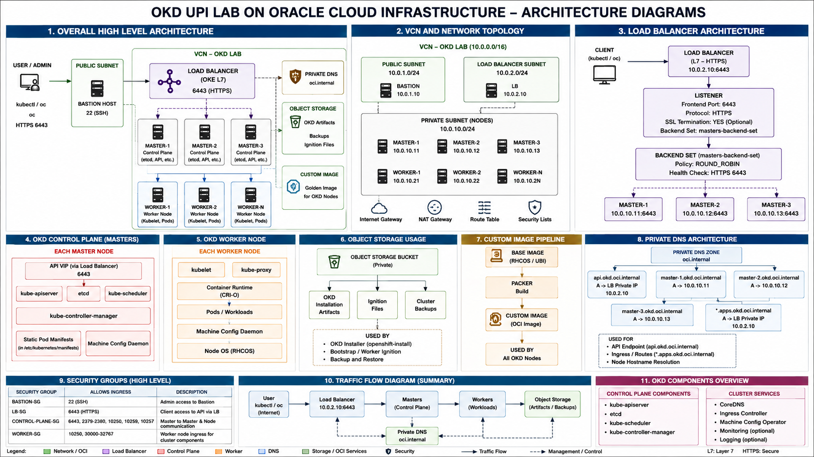

# OKD UPI Installation on Oracle Cloud Infrastructure (OCI)

## Project Overview

This project demonstrates the deployment of an OKD cluster on Oracle Cloud Infrastructure (OCI) using the **User-Provisioned Infrastructure (UPI)** installation approach.

The OCI infrastructure is provisioned using **Terraform**, including the VCN, subnets, routing, security rules, compute instances, DNS, and Load Balancer components required for the OKD cluster.

The OKD cluster consists of:

- 3 Control Plane (Master) nodes
- 2 Worker nodes
- 1 temporary Bootstrap node
- 1 Bastion host

The project also uses an OCI-based custom OS image workflow to provision the cluster nodes and configures DNS and OCI Load Balancing for API and application access.

### Key Technologies

- **OKD 4.22**
- **Kubernetes**
- **Oracle Cloud Infrastructure (OCI)**
- **Terraform**
- **OCI Load Balancer**
- **OCI DNS**
- **OCI Object Storage**
- **OCI Custom Images**
- **Linux / RHCOS-compatible OS**
- **UPI installation methodology**

### High-Level Architecture

The deployment follows this general flow:
```text
                    Internet / Users
                           |
                           v
                         DNS
                           |
                           v
                  OCI Load Balancer
                    /             \
                 :6443           :80/:443
                   |                 |
                   v                 v
             Master Nodes       Worker Nodes
                (3)                 (2)
                                   |
                                   v
                           OKD Ingress Router
                                   |
                                   v
                            Application Pods
```

Infrastructure provisioning is handled separately from the OKD installation:
```text
                    Terraform
                        |
                        v
              OCI Infrastructure
                        |
        +---------------+---------------+
        |               |               |
       VCN          Load Balancer      DNS
        |
   +----+-------------------------------+
   |                                    |
Public Subnet                    Private Subnet
10.0.1.0/24                     10.0.2.0/24
   |                                    |
Bastion                         +--------+--------+
                                |        |        |
                             Bootstrap Masters Workers
                                (1)      (3)    (2)
```


## Architecture

The following diagram shows the complete OKD UPI architecture deployed on Oracle Cloud Infrastructure (OCI).



### Architecture Components

| Component | Purpose |
|---|---|
| **OCI VCN** | Provides the network boundary for the OKD environment |
| **Public Subnet** | Hosts the Bastion and public-facing OCI Load Balancer |
| **Private Subnet** | Hosts the Bootstrap, Control Plane, and Worker nodes |
| **Bastion Host** | Provides administrative access and temporarily serves `bootstrap.ign` |
| **Bootstrap Node** | Temporarily initializes the OKD control plane during UPI installation |
| **Control Plane Nodes** | 3-node highly available OKD control plane |
| **Worker Nodes** | Run application workloads and OKD Ingress Router pods |
| **OCI Load Balancer** | Provides API and application traffic distribution |
| **OCI DNS** | Resolves API and application endpoints |
| **OCI Object Storage** | Stores the OKD OS image used during the custom image workflow |
| **OCI Custom Image** | Provides the base image used to create OKD infrastructure nodes |

### Network Layout

The deployment uses two subnets:

```text
Public Subnet
10.0.1.0/24
│
└── Bastion
    │
    └── Temporary bootstrap.ign HTTP server
```
```text
Private Subnet
10.0.2.0/24
│
├── Bootstrap
├── Master-1
├── Master-2
├── Master-3
├── Worker-1
└── Worker-2
```

## Terraform Structure

The OCI infrastructure is provisioned using Terraform modules to keep each infrastructure component separated and reusable.

```text
terraform/
├── main.tf
├── variables.tf
├── outputs.tf
├── versions.tf
│
└── modules/
    ├── network/
    │   └── OCI networking components
    │
    ├── compute/
    │   └── Bastion, Master and Worker instances
    │
    ├── loadbalancer/
    │   └── OCI Load Balancer, listeners and backend sets
    │
    ├── dns/
    │   └── Private DNS zone and OKD DNS records
    │
    ├── bootstrap/
    │   └── Temporary OKD Bootstrap instance
    │
    ├── custom-image/
    │   └── OCI custom image creation
    │
    └── object-storage/
        └── OCI Object Storage bucket and OS image
```
| Module           | Responsibility                                                                                       |
| ---------------- | ---------------------------------------------------------------------------------------------------- |
| `network`        | Creates the OCI VCN, subnets, route tables, Internet Gateway, NAT Gateway and security configuration |
| `compute`        | Creates the Bastion, Control Plane and Worker instances                                              |
| `loadbalancer`   | Creates the OCI Load Balancer, listeners, backend sets and backends                                  |
| `dns`            | Creates the private DNS zone and OKD API/application DNS records                                     |
| `bootstrap`      | Creates the temporary Bootstrap instance used during the UPI installation                            |
| `custom-image`   | Creates the OCI custom image used for the OKD nodes                                                  |
| `object-storage` | Stores the OKD OS image used by the custom image workflow                                            |


## Why UPI?

**User-Provisioned Infrastructure (UPI)** separates infrastructure provisioning from the OKD installation process.

In this project, **Terraform is responsible for provisioning the OCI infrastructure**, while the OKD installer and Ignition configuration
 are used to install and configure the cluster on the provisioned nodes.

### UPI Responsibilities

```text
Terraform
    │
    ├── VCN / Subnets
    ├── Routing
    ├── Security
    ├── DNS
    ├── Load Balancer
    ├── Bastion
    ├── Bootstrap
    ├── Control Plane
    └── Worker Nodes
             │
             ▼
        OCI Infrastructure
```
The OKD installation process then configures the provisioned machines:

OCI Infrastructure
        │
        ▼
OKD Ignition Configuration
        │
        ├── Bootstrap
        ├── Control Plane
        └── Workers
                │
                ▼
          OKD Cluster

### UPI vs Infrastructure Automation

The key separation in this project is:

| Layer | Tool / Component | Responsibility |
|---|---|---|
| Infrastructure | Terraform | Provision OCI resources |
| Operating System | OCI Custom Image | Provide the base OS for OKD nodes |
| Initial Configuration | Ignition | Configure the OKD nodes |
| Cluster Installation | OKD Installer | Bootstrap and install the OKD cluster |
| Cluster Management | OKD / Kubernetes | Manage nodes, workloads and services |

## OKD Cluster Topology

The OKD cluster was deployed using the following node architecture:

| Node / Component | Count | Purpose |
|---|---:|---|
| Bastion | 1 | Administrative access and temporary Bootstrap Ignition HTTP server |
| Bootstrap | 1 | Temporary node used during initial OKD cluster bootstrap |
| Control Plane | 3 | Provides the highly available OKD control plane |
| Worker | 2 | Runs application workloads and OKD Ingress Controller pods |

### Node Layout

| Node | Role | Network |
|---|---|---|
| Bastion | Administration / Bootstrap Ignition server | Public Subnet |
| Bootstrap | Temporary cluster bootstrap | Private Subnet |
| Master-1 | Control Plane | Private Subnet |
| Master-2 | Control Plane | Private Subnet |
| Master-3 | Control Plane | Private Subnet |
| Worker-1 | Worker / Ingress | Private Subnet |
| Worker-2 | Worker / Ingress | Private Subnet |

### Network Placement

The Bastion is placed in the public subnet, while the Bootstrap, Control Plane and Worker nodes are placed in the same private subnet.

```text
OCI VCN
│
├── Public Subnet
│   └── Bastion
│
└── Private Subnet
    ├── Bootstrap
    ├── Master-1
    ├── Master-2
    ├── Master-3
    ├── Worker-1
    └── Worker-2
```


