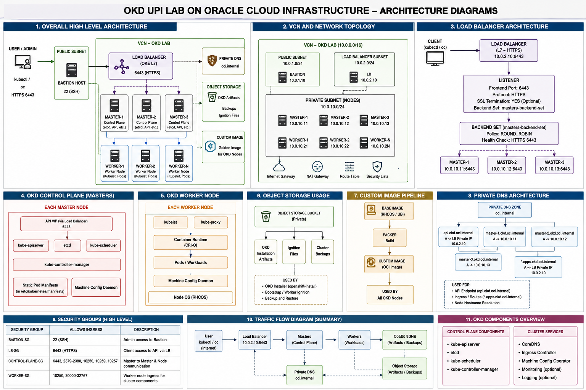
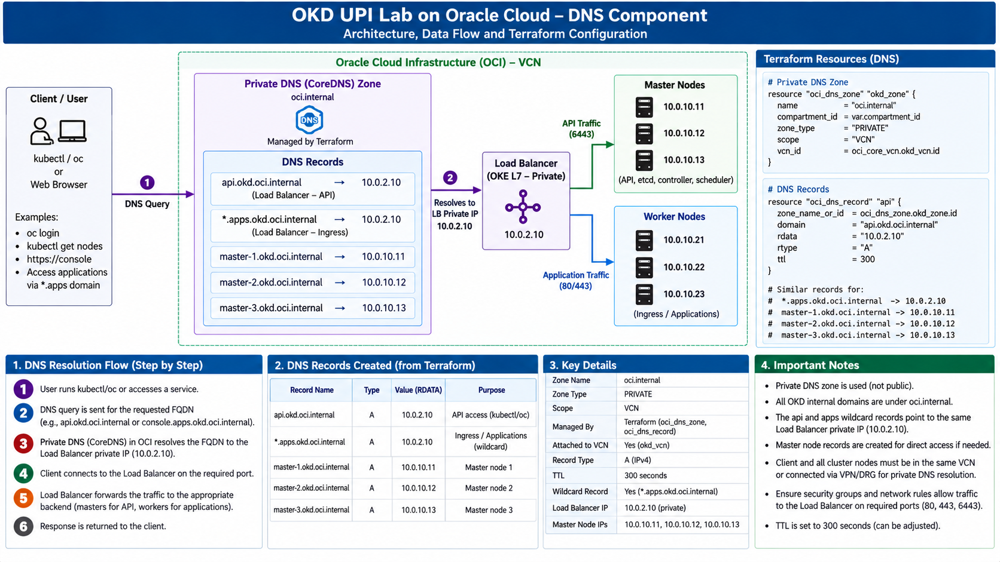

# OKD UPI Installation on Oracle Cloud Infrastructure (OCI)

## Project Overview

This project demonstrates the deployment of an OKD cluster on Oracle Cloud Infrastructure (OCI) using the **User-Provisioned Infrastructure (UPI)** installation approach.

The OCI infrastructure is provisioned using **Terraform**, including the VCN, subnets, routing, security rules, compute instances, DNS, and Load Balancer components required for the OKD cluster.

The OKD cluster consists of:

- 3 Control Plane (Master) nodes
- 2 Worker nodes
- 1 temporary Bootstrap node
- 1 Bastion host

The project also uses an OCI-based custom OS image workflow to provision the cluster nodes and configures DNS and OCI Load Balancing for API and application access.

### Key Technologies

- **OKD 4.22**
- **Kubernetes**
- **Oracle Cloud Infrastructure (OCI)**
- **Terraform**
- **OCI Load Balancer**
- **OCI DNS**
- **OCI Object Storage**
- **OCI Custom Images**
- **Linux / RHCOS-compatible OS**
- **UPI installation methodology**

### High-Level Architecture

The deployment follows this general flow:
```text
                    Internet / Users
                           |
                           v
                         DNS
                           |
                           v
                  OCI Load Balancer
                    /             \
                 :6443           :80/:443
                   |                 |
                   v                 v
             Master Nodes       Worker Nodes
                (3)                 (2)
                                   |
                                   v
                           OKD Ingress Router
                                   |
                                   v
                            Application Pods
```

Infrastructure provisioning is handled separately from the OKD installation:
```text
                    Terraform
                        |
                        v
              OCI Infrastructure
                        |
        +---------------+---------------+
        |               |               |
       VCN          Load Balancer      DNS
        |
   +----+-------------------------------+
   |                                    |
Public Subnet                    Private Subnet
10.0.1.0/24                     10.0.2.0/24
   |                                    |
Bastion                         +--------+--------+
                                |        |        |
                             Bootstrap Masters Workers
                                (1)      (3)    (2)
```


## Architecture

The following diagram shows the complete OKD UPI architecture deployed on Oracle Cloud Infrastructure (OCI).


### Architecture Components

| Component | Purpose |
|---|---|
| **OCI VCN** | Provides the network boundary for the OKD environment |
| **Public Subnet** | Hosts the Bastion and public-facing OCI Load Balancer |
| **Private Subnet** | Hosts the Bootstrap, Control Plane, and Worker nodes |
| **Bastion Host** | Provides administrative access and temporarily serves `bootstrap.ign` |
| **Bootstrap Node** | Temporarily initializes the OKD control plane during UPI installation |
| **Control Plane Nodes** | 3-node highly available OKD control plane |
| **Worker Nodes** | Run application workloads and OKD Ingress Router pods |
| **OCI Load Balancer** | Provides API and application traffic distribution |
| **OCI DNS** | Resolves API and application endpoints |
| **OCI Object Storage** | Stores the OKD OS image used during the custom image workflow |
| **OCI Custom Image** | Provides the base image used to create OKD infrastructure nodes |

### Network Layout

The deployment uses two subnets:

```text
Public Subnet
10.0.1.0/24
│
└── Bastion
    │
    └── Temporary bootstrap.ign HTTP server
```
```text
Private Subnet
10.0.2.0/24
│
├── Bootstrap
├── Master-1
├── Master-2
├── Master-3
├── Worker-1
└── Worker-2
```

## Terraform Structure

The OCI infrastructure is provisioned using Terraform modules to keep each infrastructure component separated and reusable.

```text
terraform/
├── main.tf
├── variables.tf
├── outputs.tf
├── versions.tf
│
└── modules/
    ├── network/
    │   └── OCI networking components
    │
    ├── compute/
    │   └── Bastion, Master and Worker instances
    │
    ├── loadbalancer/
    │   └── OCI Load Balancer, listeners and backend sets
    │
    ├── dns/
    │   └── Private DNS zone and OKD DNS records
    │
    ├── bootstrap/
    │   └── Temporary OKD Bootstrap instance
    │
    ├── custom-image/
    │   └── OCI custom image creation
    │
    └── object-storage/
        └── OCI Object Storage bucket and OS image
```
| Module           | Responsibility                                                                                       |
| ---------------- | ---------------------------------------------------------------------------------------------------- |
| `network`        | Creates the OCI VCN, subnets, route tables, Internet Gateway, NAT Gateway and security configuration |
| `compute`        | Creates the Bastion, Control Plane and Worker instances                                              |
| `loadbalancer`   | Creates the OCI Load Balancer, listeners, backend sets and backends                                  |
| `dns`            | Creates the private DNS zone and OKD API/application DNS records                                     |
| `bootstrap`      | Creates the temporary Bootstrap instance used during the UPI installation                            |
| `custom-image`   | Creates the OCI custom image used for the OKD nodes                                                  |
| `object-storage` | Stores the OKD OS image used by the custom image workflow                                            |


## Why UPI?

**User-Provisioned Infrastructure (UPI)** separates infrastructure provisioning from the OKD installation process.

In this project, **Terraform is responsible for provisioning the OCI infrastructure**, while the OKD installer and Ignition configuration
 are used to install and configure the cluster on the provisioned nodes.

### UPI Responsibilities

```text
Terraform
    │
    ├── VCN / Subnets
    ├── Routing
    ├── Security
    ├── DNS
    ├── Load Balancer
    ├── Bastion
    ├── Bootstrap
    ├── Control Plane
    └── Worker Nodes
             │
             ▼
        OCI Infrastructure
```
The OKD installation process then configures the provisioned machines:

OCI Infrastructure
        │
        ▼
OKD Ignition Configuration
        │
        ├── Bootstrap
        ├── Control Plane
        └── Workers
                │
                ▼
          OKD Cluster

### UPI vs Infrastructure Automation

The key separation in this project is:

| Layer | Tool / Component | Responsibility |
|---|---|---|
| Infrastructure | Terraform | Provision OCI resources |
| Operating System | OCI Custom Image | Provide the base OS for OKD nodes |
| Initial Configuration | Ignition | Configure the OKD nodes |
| Cluster Installation | OKD Installer | Bootstrap and install the OKD cluster |
| Cluster Management | OKD / Kubernetes | Manage nodes, workloads and services |

## OKD Cluster Topology

The OKD cluster was deployed using the following node architecture:

| Node / Component | Count | Purpose |
|---|---:|---|
| Bastion | 1 | Administrative access and temporary Bootstrap Ignition HTTP server |
| Bootstrap | 1 | Temporary node used during initial OKD cluster bootstrap |
| Control Plane | 3 | Provides the highly available OKD control plane |
| Worker | 2 | Runs application workloads and OKD Ingress Controller pods |

### Node Layout

| Node | Role | Network |
|---|---|---|
| Bastion | Administration / Bootstrap Ignition server | Public Subnet |
| Bootstrap | Temporary cluster bootstrap | Private Subnet |
| Master-1 | Control Plane | Private Subnet |
| Master-2 | Control Plane | Private Subnet |
| Master-3 | Control Plane | Private Subnet |
| Worker-1 | Worker / Ingress | Private Subnet |
| Worker-2 | Worker / Ingress | Private Subnet |

### Network Placement

The Bastion is placed in the public subnet, while the Bootstrap, Control Plane and Worker nodes are placed in the same private subnet.

```text
OCI VCN
│
├── Public Subnet
│   └── Bastion
│
└── Private Subnet
    ├── Bootstrap
    ├── Master-1
    ├── Master-2
    ├── Master-3
    ├── Worker-1
    └── Worker-2
```
The Bootstrap node is temporary and is removed after the OKD control plane completes the bootstrap process.

## OCI Network Architecture

The OKD cluster is deployed inside an OCI Virtual Cloud Network (VCN) using separate public and private subnets.


### Network Components

| Component | Configuration | Purpose |
|---|---|---|
| **VCN** | `10.0.0.0/16` | Provides the network boundary for the OKD environment |
| **Public Subnet** | `10.0.1.0/24` | Hosts the Bastion and public-facing Load Balancer |
| **Private Subnet** | `10.0.2.0/24` | Hosts Bootstrap, Control Plane and Worker nodes |
| **Internet Gateway** | OCI Internet Gateway | Provides internet connectivity for resources using the public route |
| **NAT Gateway** | OCI NAT Gateway | Provides outbound internet access for private subnet resources |
| **Route Tables** | Public / Private routing | Controls traffic leaving and entering the respective subnets |
| **Security Lists / NSGs** | OCI network security rules | Controls permitted inbound and outbound traffic |

### Network Layout

```text
                         OCI VCN
                      10.0.0.0/16
                           │
              ┌────────────┴────────────┐
              │                         │
       Public Subnet              Private Subnet
        10.0.1.0/24                10.0.2.0/24
              │                         │
       ┌──────┴──────┐        ┌─────────┴─────────┐
       │             │        │                   │
    Bastion       OCI LB   Bootstrap          OKD Nodes
                             │             ┌──────┴──────┐
                             │             │             │
                          Temporary      Masters      Workers
                         bootstrap.ign     ×3           ×2
                             │
                             └── HTTP :8080
                                 from Bastion
```

*Traffic and Routing*

Private OKD nodes do not require public IP addresses for normal cluster operation.

Outbound internet connectivity from the private subnet is provided through the NAT Gateway, while external API and application traffic enters through the OCI Load Balancer.

### Application Traffic Flow

```text
User
  │
  ▼
DNS
  │
  ▼
OCI Load Balancer
  │
  ├── :80  ──→ Worker-1 / Worker-2
  │
  └── :443 ──→ Worker-1 / Worker-2
                    │
                    ▼
             OKD Ingress Controller
                    │
                    ▼
                 Service
                    │
                    ▼
              Application Pod
```

### API Traffic Flow

```text
OKD Client
  │
  ▼
api.okd.ocp.lab
  │
  ▼
OCI Private DNS
  │
  ▼
OCI Load Balancer :6443
  │
  ├── Master-1
  ├── Master-2
  └── Master-3
```

### Private Node Outbound Traffic

```text
Private OKD Node
       │
       ▼
Private Route Table
       │
       ▼
NAT Gateway
       │
       ▼
Internet Gateway
       │
       ▼
Internet
```

### Network Design

The network separation provides:

- Controlled external access through the OCI Load Balancer
- Administrative access through the Bastion host
- Private networking for Bootstrap, Control Plane, and Worker nodes
- Outbound internet access for private nodes through the NAT Gateway
- Network-level traffic control using OCI Security Lists and NSGs

## Load Balancer

The OCI Load Balancer provides external access to both the OKD API and application workloads.



### Load Balancer Configuration

| Listener | Port | Backend | Purpose |
|---|---:|---|---|
| API | `6443` | Control Plane nodes | OKD / Kubernetes API access |
| HTTP | `80` | Worker nodes | Application HTTP traffic |
| HTTPS | `443` | Worker nodes | Application HTTPS traffic |

### API Traffic

```text
Client
  │
  │ :6443
  ▼
OCI Load Balancer
  │
  ├── Master-1 :6443
  ├── Master-2 :6443
  └── Master-3 :6443
```

*Application Traffic*

```text
Client
  │
  ├── :80
  │
  └── :443
       │
       ▼
OCI Load Balancer
       │
       ├── Worker-1
       └── Worker-2
              │
              ▼
       OKD Ingress Controller
              │
              ▼
           Service
              │
              ▼
        Application Pods
```

Load Balancer Health Checks

The backend sets use health checks to determine whether the configured backend nodes are available to receive traffic.

HTTP backend uses HTTP health checking on port 80
HTTPS backend uses TCP health checking on port 443
API backend uses TCP health checking on port 6443

This allows the Load Balancer to remove unhealthy backends from traffic distribution.

Traffic Flow

```text
External Client
       │
       ▼
      DNS
       │
       ▼
OCI Load Balancer
       │
       ├── :6443 ──→ Control Plane
       │
       ├── :80  ──→ Worker Nodes
       │
       └── :443 ──→ Worker Nodes
```

## DNS

OCI Private DNS is used to provide DNS resolution for the OKD cluster API and application endpoints.



### DNS Records

| DNS Record | Purpose | Resolves To |
|---|---|---|
| `api.okd.ocp.lab` | OKD API endpoint | OCI Load Balancer |
| `api-int.okd.ocp.lab` | Internal OKD API endpoint | Control Plane / API Load Balancer |
| `*.apps.okd.ocp.lab` | OKD application routes | OCI Load Balancer |

### Application DNS Flow

```text
User
  │
  │ console-openshift-console.apps.okd.ocp.lab
  ▼
OCI Private DNS
  │
  │ Resolves to Load Balancer IP
  ▼
OCI Load Balancer
  │
  ▼
Worker Nodes
  │
  ▼
OKD Ingress Controller
  │
  ▼
Application
```
*API DNS Flow*
```text
OKD Client
  │
  │ api.okd.ocp.lab
  ▼
OCI Private DNS
  │
  │ Resolves to Load Balancer IP
  ▼
OCI Load Balancer :6443
  │
  ├── Master-1
  ├── Master-2
  └── Master-3
```

Wildcard Application DNS

The wildcard record:

*.apps.okd.ocp.lab

allows different OKD Routes to use their own hostnames while resolving to the same Load Balancer.

For example:
### Application DNS Flow

The wildcard DNS entry `*.apps.okd.ocp.lab` allows different OKD Routes to use their own hostnames while resolving to the same Load Balancer.

For example:

- `console-openshift-console.apps.okd.ocp.lab`
- `oauth-openshift.apps.okd.ocp.lab`
- `<application>.apps.okd.ocp.lab`

```text
console-openshift-console.apps.okd.ocp.lab
oauth-openshift.apps.okd.ocp.lab
<application>.apps.okd.ocp.lab
        │
        ▼
OCI Private DNS
        │
        ▼
OCI Load Balancer
        │
        ▼
OKD Ingress Controller
```

*DNS Validation*

DNS resolution can be verified using:

dig +short api.okd.ocp.lab 

dig +short console-openshift-console.apps.okd.ocp.lab

The application hostname should resolve to the OCI Load Balancer IP used for external application access.